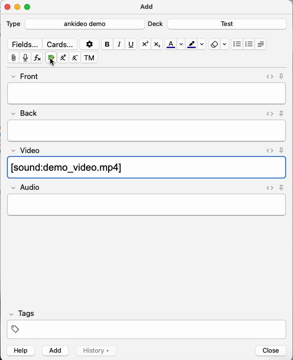

# Ankideo

Ankideo is an add-on for Anki that allows you to extract audio from a video file in field and insert it into another
field with just one click.

> [!WARNING]
> This add-on is in the early stages of development.
> Please report any issues you encounter.

## Demo

## Requirements

* Anki 2.1.20 or later
* ffmpeg

## Getting started

1. Download ffmpeg binary (specific to your OS) and move it to the `libs/ffmpeg` directory.
2. In Anki, go to `Tools > Ankideo options` and set your video field and audio field.
3. Upload a video file to the video field in the editor.
4. Press extract button. That's all!

## Dependencies

* [moviepy](https://github.com/Zulko/moviepy/releases/tag/v2.1.2)
